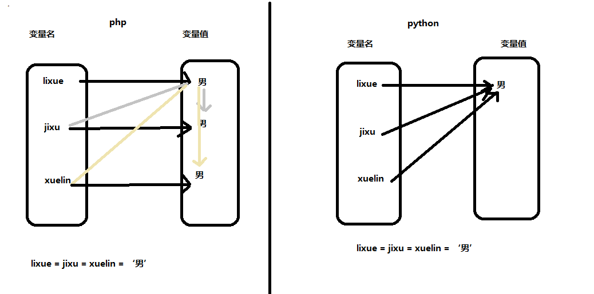

#python的安装

目前python有2个大的版本:2.X版本和3.X版本

我们的课程是基于python3.X的最新版本 3.61

##windows安装python3.6.1:

	根据操作系统的位数选择对应版本的安装程序即可。

	注意：
		安装界面中 Add python3.6.1 TO PATH的选项一定要打勾

##如何检测版本

1.打开 “开始菜单” ->点击运行（或者搜索）->输入cmd 回车就可以打开虚拟DOS界面，在界面中输入"python“ 如果能得到以下内容表示安装成功

	Python 3.6.1 (v3.6.1:69c0db5, Mar 21 2017, 17:54:52) [MSC v.1900 32 bit (Intel)] on win32                                                                       Type "help", "copyright", "credits" or "license" for more information.          >>>                                                                             
	
2.在虚拟DOS界面直接输入命令 : python -V 用于显示版本

3.在开始菜单 ->所有程序中查看->是否具有python3.6的文件夹，打开内部的IDLE也可以得到和在cmd中相同的信息
	

#python的语言特色

1.python是一门解释性的语言

	解释性语言:

		在系统运行时需要解释器将代码翻译成计算机可识别的语言,这种类型就是解释型语言.
		java,python,php...

	编译性语言:

		在系统运行程序之前，已经由开发者将源代码翻译成计算机可识别的代码，计算机直接运行即可，不需要任何解释器，这就是编译型语言。
		C，object-C

	解释语言的运行效率要比编译型要低。

2.强类型语言?弱类型语言

	强类型语言特色：

		1.存储数据时需要预先声明数据的类型
		2.在进行不同的数据类型运算时不可以运算  python

	弱类型语言特色:

		1.存储数据时不需要预先声明数据的类型    python
		2.在进行不同的数据类型运算时可以自动转换类型并且运算

3.python是一门面向对象的语言

	python支持全面的面向对象开发模式，当然python也支持过程开发和函数式开发

4.python是一门胶水语言

	python可以轻松的吧其他语言开发的模块嵌入python当中进行使用。python语言本身大部分都是由C语言构建而言。

#如何创建python文件

文件名称部分

	1.可以使用英文，不要使用中文
	2.可以使用数字，但是尽量不要全用数字
	3.可以使用_或者-等部分字符分隔文件名
	4.文件命名要有意义方便维护
	5.变量命名要避免和系统使用的保留关键字冲突

文件后缀部分

	常用文件后缀:    .py    .pyc

**注意：**查看文件后缀的方法

	win7    打开任意文件夹->组织选项->文件夹和搜索选项->查看选项卡->高级设置->去掉"隐藏已知文件类型的扩展名"前面的对勾！

	win10   打开任意文件夹->查看选项卡->倒数第三列中第二个选项(文件扩展名)勾上去

#第一个python代码
	
	print('贱人就是矫情！')

	这句代码的作用是向界面中输出一句话

#注释

注释就是注解，解释，主要用于在代码中进行代码相关的文字提示或者程序调试功能

注释一共分为2类：

	单行注释:

		#注释内容

	多行注释：

		'''
			多行内容
			多行内容
			...
		'''

		或者

		"""
			多行内容
			多行内容
			...
		"""

#python的语句分类：

python语句分为2类：单行语句和代码块/代码组

	单行语句：

		一行python代码

	代码组：
		代码组都是特定的语言结构

代码组：

	#代码组
	if 1 :
	    print('宁叫我负天下人，休叫天下人负我！')
	    print('宁叫我负天下人，休叫天下人负我！')
	    print('宁叫我负天下人，休叫天下人负我！')

# 变量

	x+y = 10
	x = 5  y = ?
	x = 3  y = ？
	这里的xy就是变量，他是是数学里面的变量

变量就是可以改变的量。

###变量赋值
基本格式:

	变量名 = 值

变量的命名规范:

	1.汉字变量名能用 不推荐用
	2.可以使用数字但是不能用数字开头
	3.不可以使用特殊字符,除了_
	4.变量严格区分大小写
	5.变量命名要有意义(规范)
	6.变量命名要避免和系统使用的保留关键字冲突

查询系统保留关键字：

	import keyword
	print(keyword.kwlist)

其他的变量赋值格式：

	变量名 = 值
	
	变量1 = 变量2 = 变量3 = 值

	变量1 ,变量2,变量3 =  值1,值2,值3

###python中变量赋值原理

python无变量，万物皆对象！

	

#python数据类型

python中可以自定义数据类型,可以具有无限中数据类型。

python提供默认6个标准数据类型：

	1.Number类型			数值类型
	2.String类型			字符类型
	3.List类型			列表类型
	4.Tuple类型			元组类型
	5.Dict类型			字典类型
	6.Set类型			集合类型

#Number类型

Number类型一共分为四个小类别：整型，浮点型，布尔型，复数

##整型
整型就是数学中的整数，包含正整数，0和负整数。

声明整型有四种方式：

	十进制： 0～9

		变量 = 十进制数字

	二进制：0～1

		变量 = 0b二进制数字

		0b二进制的标志符号

	八进制：0～7

		变量 = 0o八进制数字
		
		0o是八进制的标志符号

	十六进制：0～9A～F

		变量 = 0x十六进制数字

		0x是16进制的标志符号